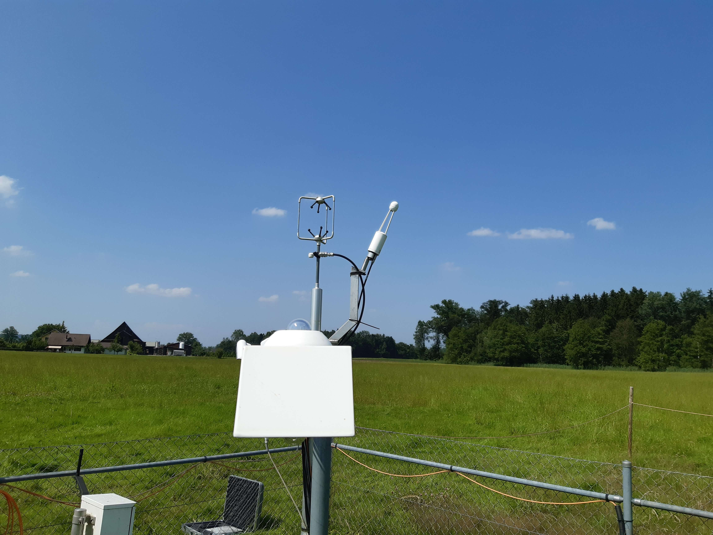
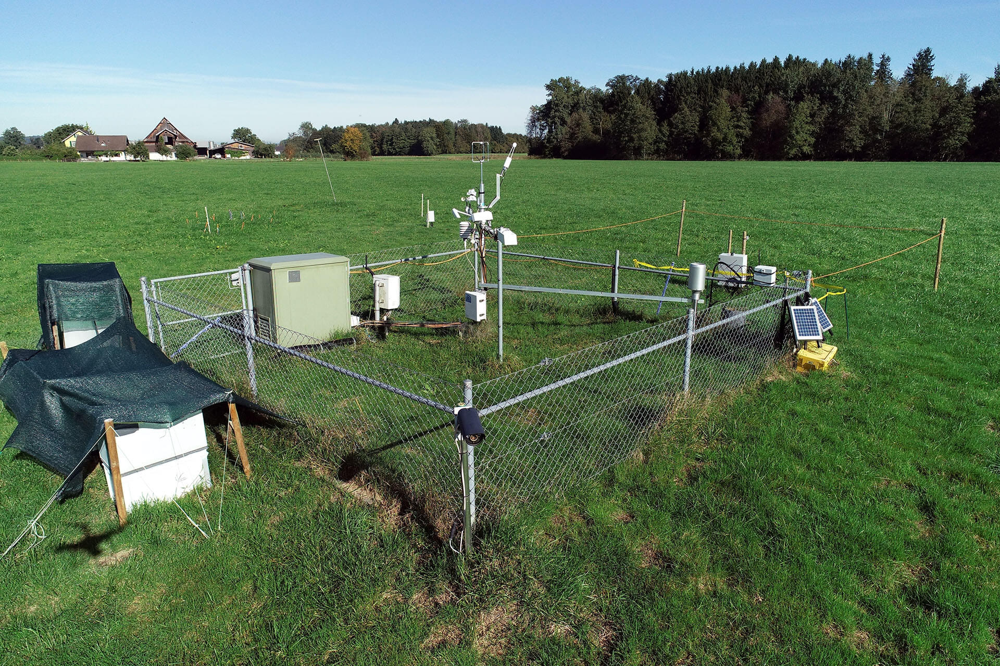
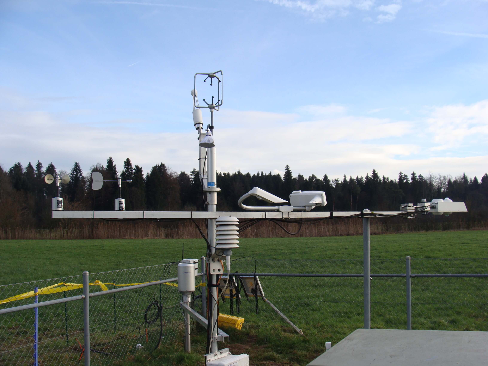
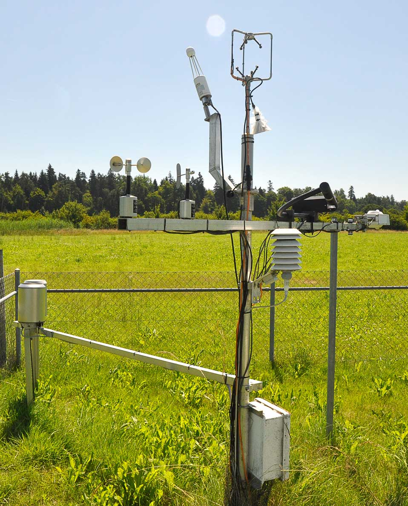
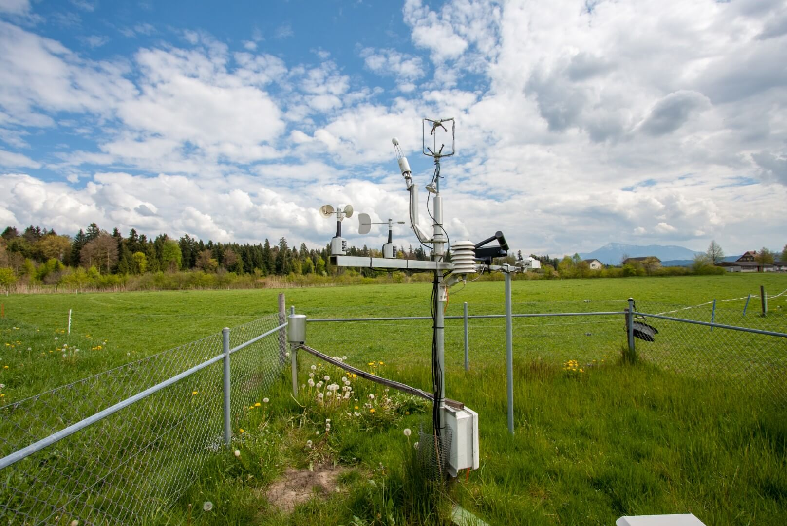
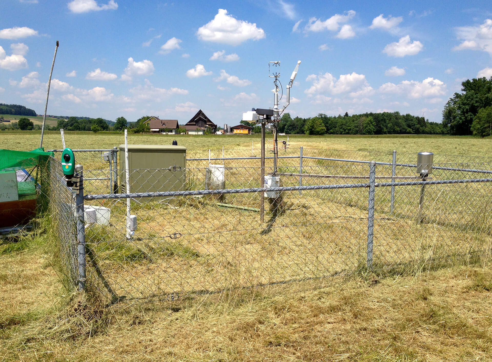
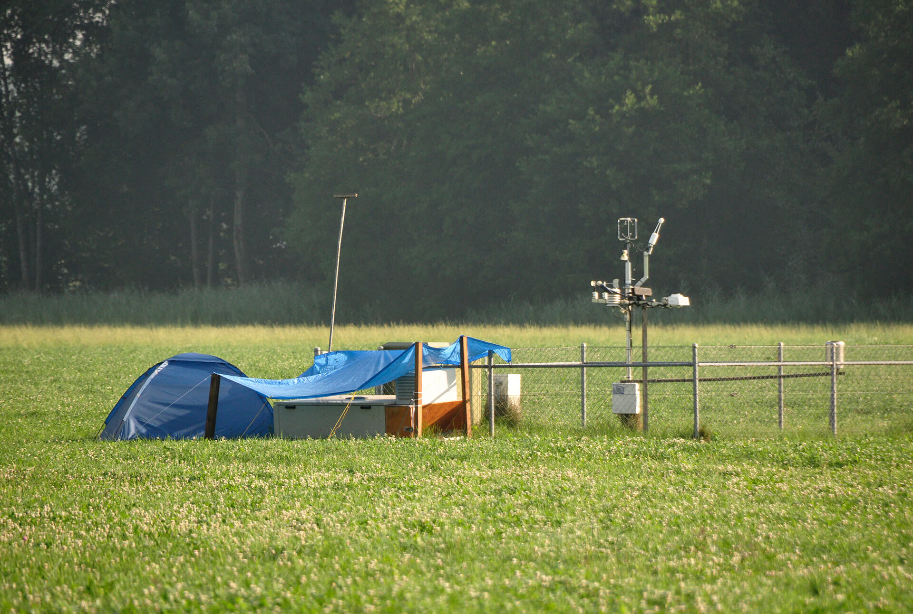
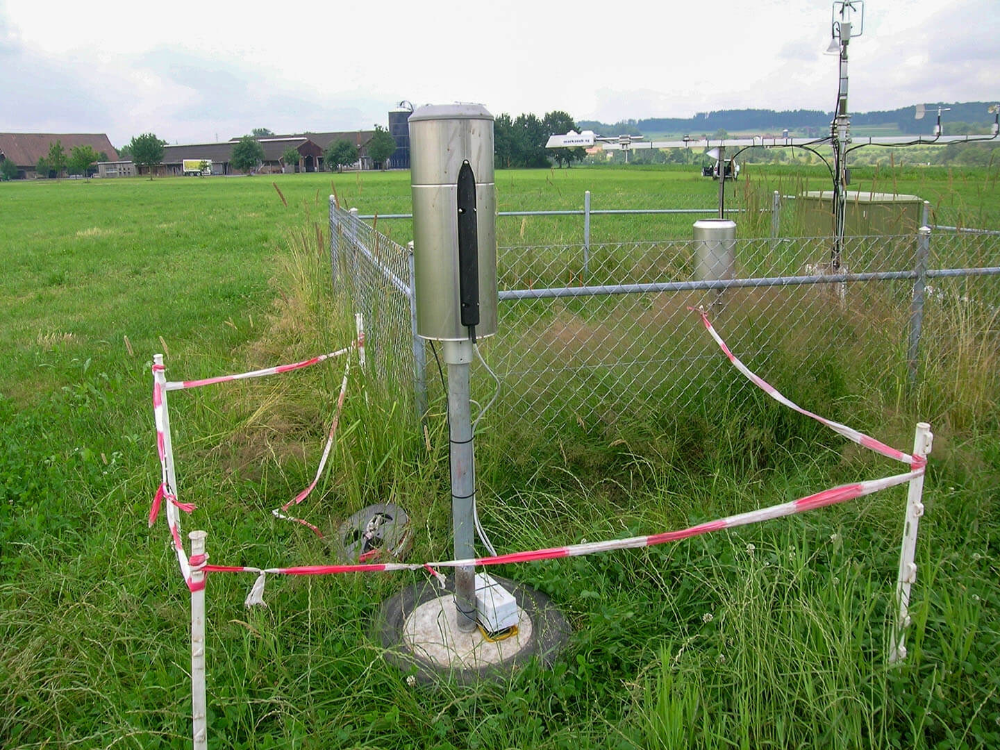

# Yearly Notes

## Info

- This page gives information about current and past flux calculations, including used software versions, and important info for each year.
- [Overview table of the setup across years](https://www.swissfluxnet.ethz.ch/index.php/sites/site-info-ch-cha/ec-raw-binary-format-ch-cha/)
- [Sheet](https://docs.google.com/spreadsheets/d/1KXaTtckHqOGULcr9nwL0FJ-xDnMJUFeDaXX8zh0fbJo/edit?gid=0#gid=0) with processing info for recent versions
- Info about some time periods is given in the form of the names of the original eddy covariance raw data files, e.g. `2019021819.C00`. 
- **Sonic orientation/height**: Should be `7°` / `2.41m` more or less and consistent across all years. In a comparison of histograms of wind directions between 2005 and 2023 showed that a sonic orientation of `7°` offset to north yields very similar results across years all years. Info from one of the oldest setup files (`locations.table`) that were used for documenting setup info in earlier years listed the sonic orientation at `0°`. In 2016, `7°` north offset was measured for the north spar, the sonic setup should be approx. the same across all years.

### General abbreviations
- `IRGA` fluxes: CO2, H2O, H
- `QCL` fluxes: N2O, CH4
- `LGR` fluxes: N2O, CH4
- `FF-`: Final fluxes

### Datasets
- `Level-3-4_PI_dataset_2005-2020`: [PI Dataset Feigentwinter et al. (2023a)](https://doi.org/10.1016/j.agrformet.2023.109613)
- `Level-3-4_PI_dataset_N2O_CH4_2019-2020`: [PI Dataset Feigentwinter et al. (2023b)](https://doi.org/10.1016/j.scitotenv.2023.166389)
- `Level-3-4_FLUXNET-WW2020_RELEASE-2022-1_FN-20220209`: [ICOS/FLUXNET Warm Winter 2020 ecosystem eddy covariance flux product](https://doi.org/10.18160/2G60-ZHAK) 
- `Level-3-4_FLUXNET2015-FN-20190606-beta-3`: [FLUXNET Drought-2018 ecosystem eddy covariance flux product](https://doi.org/10.18160/YVR0-4898)
- `Level-3-4_FLUXNET2015-FN-20161021`: [FLUXNET2015 Dataset](https://fluxnet.org/data/fluxnet2015-dataset/), described in [Pastorello et al. (2020)](https://doi.org/10.1038/s41597-020-0534-3)
- `Level-3-4_FLUXNET-CH4-2020_V1_2012-2016`: [FLUXNET-CH4 Community Product](https://fluxnet.org/data/fluxnet-ch4-community-product/)

## 2024

### FF-202501 (IRGA75)
 
- **Final Flux Version**: R350-IRGA75_FF-202501
- **Level-1**: Level-1_FR-20250124-134851
- **Level-4 ID(s)**: *in progress*
- **Setup**: [Setup since 2005](https://www.swissfluxnet.ethz.ch/index.php/sites/ch-cha-chamau/data-ch-cha/ec-raw-binary-format-ch-cha/)
- **Instruments**: R350, IRGA75
- **Scripts**: [bico](https://github.com/holukas/bico) v1.6.5, [fluxrun](https://github.com/holukas/fluxrun) v1.4.1 ([EddyPro](https://www.licor.com/env/products/eddy-covariance/eddypro) v7.0.9)
- **FLUXNET Upload**: 20 Apr 2025
- **Notes**:
	- [Progress notes on Google Docs](https://docs.google.com/spreadsheets/d/1KXaTtckHqOGULcr9nwL0FJ-xDnMJUFeDaXX8zh0fbJo/edit?usp=sharing)
	- calculated without angle-of-attack correction

---
## 2023
### General notes
- During this year, there have been some sporadic events where the unrotated vertical wind variable `W_UNROT` shows a clear (most likely constant) offset. These periods are generally short and lasted a few days. These periods need to be calculated separately from unaffected periods by using a constant `W` offset in EddyPro. Not correcting for this issue causes fluxes to become less pronounced, e.g. the diel cycle becomes less clear.
- **Wind offset** in sonic anemometer data for vertical wind component W: W jumps to higher values and then remains stable around this higher value. This issue can be more or less corrected in EddyPro by defining an offset for the vertical wind measurements. The affected time periods are (inlcuding offsets, using middle timestamp for half-hours): 
#### `W` offsets
- All these time periods should be calculated together in one run, using a **mean offset** of `1.173283`.
- between 2023-04-17 10:15 and 2023-04-20 06:15: `1.163599708029197`
- between 2023-07-21 15:45 and 2023-07-21 18:45: `1.1862112857142857`
- between 2023-08-23 14:15 and 2023-08-24 18:45: `1.2251075862068965`
- between 2023-08-26 16:45 and 2023-08-30 08:45: `1.0117830873920455` (during this time period, there seems to be another issue on 28 Aug 2023, but only for approx. one half day, otherwise this offset would also be approx. 1.2)
- between 2023-09-14 00:45 and 2023-09-18 15:45: `1.187201864864865`
- between 2023-09-22 00:45 and 2023-09-26 14:45: `1.1451817454545454` 
- between 2023-09-28 08:45 and 2023-09-29 14:15: `1.132388540677966`.  

### FF-202503 (IRGA75)
 
- **Final Flux Version**: R350-IRGA75_FF-202503
- **Level-1**: 
	- Level-1_CH-CHA_FR-20250303-102224
	- Level-1_CH-CHA_FR-20250304-093959_W-OFFSET (corrected `W` offset periods)
- **Level-4 ID(s)**: *in progress*
- **Setup**: [Setup since 2005](https://www.swissfluxnet.ethz.ch/index.php/sites/ch-cha-chamau/data-ch-cha/ec-raw-binary-format-ch-cha/)
- **Instruments**: R350, IRGA75
- **Scripts**: [bico](https://github.com/holukas/bico) v1.6.5, [fluxrun](https://github.com/holukas/fluxrun) v1.4.1 ([EddyPro](https://www.licor.com/env/products/eddy-covariance/eddypro) v7.0.9)
- **FLUXNET Upload**: 20 Apr 2025
- **Notes**:
	- [Progress notes on Google Docs](https://docs.google.com/spreadsheets/d/1KXaTtckHqOGULcr9nwL0FJ-xDnMJUFeDaXX8zh0fbJo/edit?usp=sharing)
	- calculated without angle-of-attack correction
	- `W` offset periods were calculated separately from unaffected time periods

### Deprecated versions
- **FF-202407 (IRGA75)** | Final Flux Version: R350-IRGA75_FF-202407 | Level-1: Level-1_FR-20240726-181748 | Level-4 ID(s): *in progress* | Setup: [Setup since 2005](https://www.swissfluxnet.ethz.ch/index.php/sites/ch-cha-chamau/data-ch-cha/ec-raw-binary-format-ch-cha/) | Instruments: R350, IRGA75 | Scripts: [bico](https://github.com/holukas/bico) v1.6.5, [fluxrun](https://github.com/holukas/fluxrun) v1.4.1 ([EddyPro](https://www.licor.com/env/products/eddy-covariance/eddypro) v7.0.9) | FLUXNET Upload: - | Notes: [Progress notes on Google Docs](https://docs.google.com/spreadsheets/d/1KXaTtckHqOGULcr9nwL0FJ-xDnMJUFeDaXX8zh0fbJo/edit?usp=sharing); calculated without angle-of-attack correction
- **FF-202403 (IRGA75, deprecated)** | Final Flux Version: R350-IRGA75_FF-202403 | Level-1: Level-1_FR-20240326-143413_AoA | Level-4 ID(s): *in progress* | Setup: [Setup since 2005](https://www.swissfluxnet.ethz.ch/index.php/sites/ch-cha-chamau/data-ch-cha/ec-raw-binary-format-ch-cha/) | Instruments: R350, IRGA75 | Scripts: [bico](https://github.com/holukas/bico) v1.6.0, [fluxrun](https://github.com/holukas/fluxrun) v1.3.1 ([EddyPro](https://www.licor.com/env/products/eddy-covariance/eddypro) v7.0.9) | FLUXNET Upload: - | Notes: calculated with angle-of-attack correction, to be consistent with previous years
- **FF-202403 (IRGA75, deprecated)** | Final Flux Version: R350-IRGA75_FF-202403 | Level-1: Level-1_FR-20240326-143214_NoAoA | Level-4 ID(s): *in progress* | Setup: [Setup since 2005](https://www.swissfluxnet.ethz.ch/index.php/sites/ch-cha-chamau/data-ch-cha/ec-raw-binary-format-ch-cha/) | Instruments: R350, IRGA75 | Scripts: [bico](https://github.com/holukas/bico) v1.6.0, [fluxrun](https://github.com/holukas/fluxrun) v1.3.1 ([EddyPro](https://www.licor.com/env/products/eddy-covariance/eddypro) v7.0.9) | FLUXNET Upload: 27 Mar 2024 | Notes: variant calculated without angle-of-attack correction

---
## 2022

### FF-202407 (IRGA75)
 
- **Final Flux Version**: R350-IRGA75_FF-202407
- **Level-1**: Level-1_FR-20240726-181747, Level-1_FR-20240726-181749
- **Level-4 ID(s)**: *in progress*
- **Setup**: [Setup since 2005](https://www.swissfluxnet.ethz.ch/index.php/sites/ch-cha-chamau/data-ch-cha/ec-raw-binary-format-ch-cha/)
- **Instruments**: R350, IRGA75
- **Scripts**: [bico](https://github.com/holukas/bico) v1.6.5, [fluxrun](https://github.com/holukas/fluxrun) v1.4.1 ([EddyPro](https://www.licor.com/env/products/eddy-covariance/eddypro) v7.0.9)
- **FLUXNET Upload**: 20 Apr 2025
- **Notes**:
	- [Progress notes on Google Docs](https://docs.google.com/spreadsheets/d/1KXaTtckHqOGULcr9nwL0FJ-xDnMJUFeDaXX8zh0fbJo/edit?usp=sharing)
	- calculated without angle-of-attack correction

### FF-202407 (LGR)
 
- **Final Flux Version**: R350-LGR_FF-202407
- **Level-1**: Level-1_FR-20240809-181345
- **Level-4 ID(s)**: *in progress*
- **Setup**: [Setup since 2005](https://www.swissfluxnet.ethz.ch/index.php/sites/ch-cha-chamau/data-ch-cha/ec-raw-binary-format-ch-cha/)
- **Instruments**: R350, LGR
- **Scripts**: [bico](https://github.com/holukas/bico) v1.6.5, [fluxrun](https://github.com/holukas/fluxrun) v1.4.1 ([EddyPro](https://www.licor.com/env/products/eddy-covariance/eddypro) v7.0.9)
- **FLUXNET Upload**: 28 Feb 2025
- **Notes**:
	- [Progress notes on Google Docs](https://docs.google.com/spreadsheets/d/1KXaTtckHqOGULcr9nwL0FJ-xDnMJUFeDaXX8zh0fbJo/edit?usp=sharing)
	- calculated without angle-of-attack correction
	- last year with LGR fluxes

### Deprecated versions
- **FF-202307 (IRGA75, deprecated)** | Final Flux Version: R350-IRGA75_FF-202307 | Level-1: Level-1_FR-20231026-115535_AoA | Level-4 ID(s): *in progress* | Setup: [Setup since 2005](https://www.swissfluxnet.ethz.ch/index.php/sites/ch-cha-chamau/data-ch-cha/ec-raw-binary-format-ch-cha/) | Instruments: R350, IRGA75 | Scripts: [bico](https://github.com/holukas/bico) v1.6.0, [fluxrun](https://github.com/holukas/fluxrun) v1.3.1 ([EddyPro](https://www.licor.com/env/products/eddy-covariance/eddypro) v7.0.9) | FLUXNET Upload: - | Notes: calculated with angle-of-attack correction, to be consistent with previous years
- **FF-202307 (IRGA75, deprecated)** | Final Flux Version: R350-IRGA75_FF-202307 | Level-1: Level-1_FR-20231026-161730_NoAoA | Level-4 ID(s): *in progress* | Setup: [Setup since 2005](https://www.swissfluxnet.ethz.ch/index.php/sites/ch-cha-chamau/data-ch-cha/ec-raw-binary-format-ch-cha/) | Instruments: R350, IRGA75 | Scripts: [bico](https://github.com/holukas/bico) v1.6.0, [fluxrun](https://github.com/holukas/fluxrun) v1.3.1 ([EddyPro](https://www.licor.com/env/products/eddy-covariance/eddypro) v7.0.9) | FLUXNET Upload: 27 Oct 2023 | Notes: variant calculated without angle-of-attack correction
- **FF-202307 (LGR, deprecated)** | Final Flux Version: R350-LGR_FF-202307 | Level-1: Level-1_FR-20231028-112955 | Level-4 ID(s): *in progress* | Setup: [Setup since 2005](https://www.swissfluxnet.ethz.ch/index.php/sites/ch-cha-chamau/data-ch-cha/ec-raw-binary-format-ch-cha/) | Instruments: R350, LGR | Scripts: [bico](https://github.com/holukas/bico) v1.6.0, [fluxrun](https://github.com/holukas/fluxrun) v1.3.1 ([EddyPro](https://www.licor.com/env/products/eddy-covariance/eddypro) v7.0.9) | FLUXNET Upload: - | Notes: no angle-of-attack correction

---
## 2021

:::{figure-md} photo-ec6

Photo of the CH-CHA research site on 20 Jul 2021. Photo: Grassland Sciences Group, ETH Zurich
:::

### FF-202407 (IRGA75)
 
- **Final Flux Version**: R350-IRGA75_FF-202407
- **Level-1**: Level-1_FR-20240727-005940, Level-1_FR-20240727-010348
- **Level-4 ID(s)**: *in progress*
- **Setup**: [Setup since 2005](https://www.swissfluxnet.ethz.ch/index.php/sites/ch-cha-chamau/data-ch-cha/ec-raw-binary-format-ch-cha/)
- **Instruments**: R350, IRGA75
- **Scripts**: [bico](https://github.com/holukas/bico) v1.6.5, [fluxrun](https://github.com/holukas/fluxrun) v1.4.1 ([EddyPro](https://www.licor.com/env/products/eddy-covariance/eddypro) v7.0.9)
- **FLUXNET Upload**: 20 Apr 2025
- **Notes**:
	- [Progress notes on Google Docs](https://docs.google.com/spreadsheets/d/1KXaTtckHqOGULcr9nwL0FJ-xDnMJUFeDaXX8zh0fbJo/edit?usp=sharing)
	- calculated without angle-of-attack correction

### FF-202407 (LGR)
 
- **Final Flux Version**: R350-LGR_FF-202407
- **Level-1**: Level-1_FR-20240809-181345
- **Level-4 ID(s)**: *in progress*
- **Setup**: [Setup since 2005](https://www.swissfluxnet.ethz.ch/index.php/sites/ch-cha-chamau/data-ch-cha/ec-raw-binary-format-ch-cha/)
- **Instruments**: R350, LGR
- **Scripts**: [bico](https://github.com/holukas/bico) v1.6.5, [fluxrun](https://github.com/holukas/fluxrun) v1.4.1 ([EddyPro](https://www.licor.com/env/products/eddy-covariance/eddypro) v7.0.9)
- **FLUXNET Upload**: 28 Feb 2025
- **Notes**:
	- [Progress notes on Google Docs](https://docs.google.com/spreadsheets/d/1KXaTtckHqOGULcr9nwL0FJ-xDnMJUFeDaXX8zh0fbJo/edit?usp=sharing)
	- calculated without angle-of-attack correction
	- first year with LGR fluxes

### FF-202407 (QCL)
 
- **Final Flux Version**: R350-QCL_FF-202407
- **Level-1**: Level-1_FR-20240809-181351
- **Level-4 ID(s)**: *in progress*
- **Setup**: [Setup since 2005](https://www.swissfluxnet.ethz.ch/index.php/sites/ch-cha-chamau/data-ch-cha/ec-raw-binary-format-ch-cha/)
- **Instruments**: R350, QCL
- **Scripts**: [bico](https://github.com/holukas/bico) v1.6.5, [fluxrun](https://github.com/holukas/fluxrun) v1.4.1 ([EddyPro](https://www.licor.com/env/products/eddy-covariance/eddypro) v7.0.9)
- **FLUXNET Upload**: 28 Feb 2025
- **Notes**:
	- [Progress notes on Google Docs](https://docs.google.com/spreadsheets/d/1KXaTtckHqOGULcr9nwL0FJ-xDnMJUFeDaXX8zh0fbJo/edit?usp=sharing)
	- calculated without angle-of-attack correction
	- last year with QCL fluxes

### Deprecated versions
- **FF-202306 (IRGA75, deprecated)** | Final Flux Version: R350-IRGA75_FF-202306 | Level-1: 3 parts: Level-1_FR-20230809-104348 / Level-1_FR-20230809-104955 / Level-1_FR-20230810-095226 | Level-4 ID(s): *in progress* | Setup: [Setup since 2005](https://www.swissfluxnet.ethz.ch/index.php/sites/ch-cha-chamau/data-ch-cha/ec-raw-binary-format-ch-cha/) | Instruments: R350, IRGA75 | Scripts: [bico](https://github.com/holukas/bico) v1.3.0, [fluxrun](https://github.com/holukas/fluxrun) v1.3.0 ([EddyPro](https://www.licor.com/env/products/eddy-covariance/eddypro) v7.0.9) | FLUXNET Upload: - | Notes: calculated with angle-of-attack correction, to be consistent with previous years
- **FF-202306 (IRGA75, deprecated)** | Final Flux Version: R350-IRGA75_FF-202306 | Level-1: 3 parts: Level-1_FR-20230626-120326 / Level-1_FR-20230807-121916 / Level-1_FR-20230808-115504 | Level-4 ID(s): *in progress* | Setup: [Setup since 2005](https://www.swissfluxnet.ethz.ch/index.php/sites/ch-cha-chamau/data-ch-cha/ec-raw-binary-format-ch-cha/) | Instruments: R350, IRGA75 | Scripts: [bico](https://github.com/holukas/bico) v1.3.0, [fluxrun](https://github.com/holukas/fluxrun) v1.3.0 ([EddyPro](https://www.licor.com/env/products/eddy-covariance/eddypro) v7.0.9) | FLUXNET Upload: 21 Aug 2023 | Notes: variant calculated without angle-of-attack correction
- **FF-202306 (QCL, deprecated)** | Final Flux Version: R350-QCL_FF-202306 | Level-1: Level-1_FR-20230626-120549 | Level-4 ID(s): *in progress* | Setup: [Setup since 2005](https://www.swissfluxnet.ethz.ch/index.php/sites/ch-cha-chamau/data-ch-cha/ec-raw-binary-format-ch-cha/) | Instruments: R350, QCL | Scripts: [bico](https://github.com/holukas/bico) v1.3.0, [fluxrun](https://github.com/holukas/fluxrun) v1.3.0 ([EddyPro](https://www.licor.com/env/products/eddy-covariance/eddypro) v7.0.9) | FLUXNET Upload: - | Notes: without angle-of-attack correction
- **FF-202306 (LGR, deprecated)** | Final Flux Version: R350-LGR_FF-202306 | Level-1: Level-1_FR-20230807-095427 / Level-1_FR-20230807-095844 | Level-4 ID(s): *in progress* | Setup: [Setup since 2005](https://www.swissfluxnet.ethz.ch/index.php/sites/ch-cha-chamau/data-ch-cha/ec-raw-binary-format-ch-cha/) | Instruments: R350, LGR | Scripts: [bico](https://github.com/holukas/bico) v1.3.0, [fluxrun](https://github.com/holukas/fluxrun) v1.3.0 ([EddyPro](https://www.licor.com/env/products/eddy-covariance/eddypro) v7.0.9) | FLUXNET Upload: - | Notes: without angle-of-attack correction

---

## 2020

### FF-202407 (IRGA75)
 
- **Final Flux Version**: R350-IRGA75_FF-202407
- **Level-1**: Level-1_FR-20240727-210028, Level-1_FR-20240727-210053, Level-1_FR-20240730-112251
- **Level-4 ID(s)**: *in progress*
- **Setup**: [Setup since 2005](https://www.swissfluxnet.ethz.ch/index.php/sites/ch-cha-chamau/data-ch-cha/ec-raw-binary-format-ch-cha/)
- **Instruments**: R350, IRGA75
- **Scripts**: [bico](https://github.com/holukas/bico) v1.6.5, [fluxrun](https://github.com/holukas/fluxrun) v1.4.1 ([EddyPro](https://www.licor.com/env/products/eddy-covariance/eddypro) v7.0.9)
- **FLUXNET Upload**: 20 Apr 2025
- **Notes**:
	- [Progress notes on Google Docs](https://docs.google.com/spreadsheets/d/1KXaTtckHqOGULcr9nwL0FJ-xDnMJUFeDaXX8zh0fbJo/edit?usp=sharing)
	- calculated without angle-of-attack correction

### FF-202407 (QCL)
 
- **Final Flux Version**: R350-QCL_FF-202407
- **Level-1**: Level-1_FR-20240809-181351, Level-1_FR-20240813-123539, Level-1_FR-20240813-124302
- **Level-4 ID(s)**: *in progress*
- **Setup**: [Setup since 2005](https://www.swissfluxnet.ethz.ch/index.php/sites/ch-cha-chamau/data-ch-cha/ec-raw-binary-format-ch-cha/)
- **Instruments**: R350, QCL
- **Scripts**: [bico](https://github.com/holukas/bico) v1.6.5, [fluxrun](https://github.com/holukas/fluxrun) v1.4.1 ([EddyPro](https://www.licor.com/env/products/eddy-covariance/eddypro) v7.0.9)
- **FLUXNET Upload**: 28 Feb 2025
- **Notes**:
	- [Progress notes on Google Docs](https://docs.google.com/spreadsheets/d/1KXaTtckHqOGULcr9nwL0FJ-xDnMJUFeDaXX8zh0fbJo/edit?usp=sharing)
	- calculated without angle-of-attack correction

### Deprecated versions
- **FF-202108 (IRGA75, deprecated)** | Final Flux Version: FF-202108 | Level-1: Level-1_FR-20210727-113252 | Level-4 ID(s): Level-3-4_PI_dataset_2005-2020 | Setup: [Setup since 2005](https://www.swissfluxnet.ethz.ch/index.php/sites/ch-cha-chamau/data-ch-cha/ec-raw-binary-format-ch-cha/) | Instruments: R350, IRGA75 | Scripts: [FR](https://gitlab.ethz.ch/holukas/fluxrun) 0.5.0 with [EddyPro](https://www.licor.com/env/products/eddy_covariance/eddypro) 7.0.6, [DIIVE](https://gitlab.ethz.ch/holukas/diive) v0.21.0, [BICO](https://gitlab.ethz.ch/holukas/bico) 0.5.0 (binary conversion) | FLUXNET Upload: - | Notes: Differences to previous version: calculated with angle-of-attack correction
- **FF-202101 (QCL, deprecated)** | Final Flux Version: R350-QCL_FF-202101 | Level-1: Level-1_FR-20210329 / Level-1_FR-20210329-101401 / Level-1_FR-20210329-161921 | Level-4 ID(s): Level-3-4_PI_dataset_N2O_CH4_2019-2020 | Setup: [Setup since 2005](https://www.swissfluxnet.ethz.ch/index.php/sites/ch-cha-chamau/data-ch-cha/ec-raw-binary-format-ch-cha/) | Instruments: R350, QCL | Scripts: [FR](https://gitlab.ethz.ch/holukas/fluxrun) 0.5.0 with [EddyPro](https://www.licor.com/env/products/eddy_covariance/eddypro) 7.0.6, [DIIVE](https://gitlab.ethz.ch/holukas/diive) v0.21.0, [BICO](https://gitlab.ethz.ch/holukas/bico) 0.5.0 (binary conversion) | FLUXNET Upload: - | Notes: -
- **FF-202101 (IRGA75, deprecated)** | Final Flux Version: FF-202101 | Level-1: Level-1_FR-20210318-171526 | Level-4 ID(s): Level-3-4_FLUXNET-WW2020_RELEASE-2022-1_FN-20220209 | Setup: [Setup since 2005](https://www.swissfluxnet.ethz.ch/index.php/sites/ch-cha-chamau/data-ch-cha/ec-raw-binary-format-ch-cha/) | Instruments: R350, IRGA75 | Scripts: [BICO](https://gitlab.ethz.ch/holukas/bico) v0.5.0, [FLUXRUN](https://gitlab.ethz.ch/holukas/fluxrun) v0.5.0(?), [DIIVE](https://gitlab.ethz.ch/holukas/diive) v0.17.0 | FLUXNET Upload: 1 Apr 2021 | Notes: Data for full year; Used file for dynamic vegetation height

---

## 2019

:::{figure-md} photo-ec9

Photo of the CH-CHA research site in Oct 2019. Photo: Grassland Sciences Group, ETH Zurich
:::

### General notes
- **QCL time lag** is quite unclear during the time period between `2019021819.C00` and `2019043019.C00`. Most likely around +7s for N2O and CH4. 

### FF-202407 (IRGA75)
 
- **Final Flux Version**: R350-IRGA75_FF-202407
- **Level-1**: Level-1_FR-20240727-210200
- **Level-4 ID(s)**: *in progress*
- **Setup**: [Setup since 2005](https://www.swissfluxnet.ethz.ch/index.php/sites/ch-cha-chamau/data-ch-cha/ec-raw-binary-format-ch-cha/)
- **Instruments**: R350, IRGA75
- **Scripts**: [bico](https://github.com/holukas/bico) v1.6.5, [fluxrun](https://github.com/holukas/fluxrun) v1.4.1 ([EddyPro](https://www.licor.com/env/products/eddy-covariance/eddypro) v7.0.9)
- **FLUXNET Upload**: 20 Apr 2025
- **Notes**:
	- [Progress notes on Google Docs](https://docs.google.com/spreadsheets/d/1KXaTtckHqOGULcr9nwL0FJ-xDnMJUFeDaXX8zh0fbJo/edit?usp=sharing)
	- calculated without angle-of-attack correction

### FF-202407 (QCL)
 
- **Final Flux Version**: R350-QCL_FF-202407
- **Level-1**: Level-1_FR-20240812-132901, Level-1_FR-20240812-142125, Level-1_FR-20240812-144207, Level-1_FR-20240812-151728
- **Level-4 ID(s)**: *in progress*
- **Setup**: [Setup since 2005](https://www.swissfluxnet.ethz.ch/index.php/sites/ch-cha-chamau/data-ch-cha/ec-raw-binary-format-ch-cha/)
- **Instruments**: R350, QCL
- **Scripts**: [bico](https://github.com/holukas/bico) v1.6.5, [fluxrun](https://github.com/holukas/fluxrun) v1.4.1 ([EddyPro](https://www.licor.com/env/products/eddy-covariance/eddypro) v7.0.9)
- **FLUXNET Upload**: 28 Feb 2025
- **Notes**:
	- [Progress notes on Google Docs](https://docs.google.com/spreadsheets/d/1KXaTtckHqOGULcr9nwL0FJ-xDnMJUFeDaXX8zh0fbJo/edit?usp=sharing)
	- calculated without angle-of-attack correction

### Deprecated versions
- **FF-202108 (IRGA75, deprecated)** | Final Flux Version: FF-202108 | Level-1: Level-1_FR-20210809-121703 | Level-4 ID(s): Level-3-4_PI_dataset_2005-2020 | Setup: [Setup since 2005](https://www.swissfluxnet.ethz.ch/index.php/sites/ch-cha-chamau/data-ch-cha/ec-raw-binary-format-ch-cha/) | Instruments: R350, IRGA75 | Scripts: [FR](https://gitlab.ethz.ch/holukas/fluxrun) 0.5.0 with [EddyPro](https://www.licor.com/env/products/eddy_covariance/eddypro) 7.0.6, [DIIVE](https://gitlab.ethz.ch/holukas/diive) v0.21.0, [BICO](https://gitlab.ethz.ch/holukas/bico) 0.5.0 (binary conversion) | FLUXNET Upload: - | Notes: Differences to previous version: calculated with angle-of-attack correction; used file for dynamic vegetation height
- **FF-202101 (QCL, deprecated)** | Final Flux Version: R350-QCL_FF-202101 | Level-1: Level-1_CH-CHA_FR-20210329-102017 / Level-1_CH-CHA_FR-20210329-110058 / Level-1_CH-CHA_FR-20210412-135410 | Level-4 ID(s): Level-3-4_PI_dataset_N2O_CH4_2019-2020 | Setup: [Setup since 2005](https://www.swissfluxnet.ethz.ch/index.php/sites/ch-cha-chamau/data-ch-cha/ec-raw-binary-format-ch-cha/) | Instruments: R350, QCL | Scripts: [FR](https://gitlab.ethz.ch/holukas/fluxrun) 0.5.0 with [EddyPro](https://www.licor.com/env/products/eddy_covariance/eddypro) 7.0.6, [DIIVE](https://gitlab.ethz.ch/holukas/diive) v0.21.0, [BICO](https://gitlab.ethz.ch/holukas/bico) 0.5.0 (binary conversion) | FLUXNET Upload: - | Notes: -
- **FF-202008 (IRGA75, deprecated)** | Final Flux Version: FF-202008 | Level-1: Level-1_ID2020-08-06T170629 | Level-4 ID(s): Level-3-4_FLUXNET-WW2020_RELEASE-2022-1_FN-20220209 | Setup: [Setup since 2005](https://www.swissfluxnet.ethz.ch/index.php/sites/ch-cha-chamau/data-ch-cha/ec-raw-binary-format-ch-cha/) | Instruments: R350, IRGA75 | Scripts: [FCT v0.9.6](https://gitlab.ethz.ch/holukas/fct-flux-calculation-tool/-/releases/v0.9.6) (Level-1 calcs), [FQC v2.1.2](https://gitlab.ethz.ch/holukas/fqc-flux-quality-control/-/releases/v2.1.2) (Level-2 QC), Amp v0.16.0 | FLUXNET Upload: 17 Aug 2020 | Notes: First final flux calculations for 2019; For more info, see here: [CH-CHA / FF-202008](https://www.swissfluxnet.ethz.ch/index.php/documentation/ch-cha-ff-202008/).

---
## 2018

:::{figure-md} photo-ec3

Photo of the CH-CHA research site on 16 Nov 2018. Photo: Grassland Sciences Group, ETH Zurich
:::

### FF-202407 (IRGA75)
 
- **Final Flux Version**: R350-IRGA75_FF-202407
- **Level-1**: Level-1_FR-20240727-210213, Level-1_FR-20240730-112301, Level-1_FR-20240730-112310
- **Level-4 ID(s)**: *in progress*
- **Setup**: [Setup since 2005](https://www.swissfluxnet.ethz.ch/index.php/sites/ch-cha-chamau/data-ch-cha/ec-raw-binary-format-ch-cha/)
- **Instruments**: R350, IRGA75
- **Scripts**: [bico](https://github.com/holukas/bico) v1.6.5, [fluxrun](https://github.com/holukas/fluxrun) v1.4.1 ([EddyPro](https://www.licor.com/env/products/eddy-covariance/eddypro) v7.0.9)
- **FLUXNET Upload**: 20 Apr 2025
- **Notes**:
	- [Progress notes on Google Docs](https://docs.google.com/spreadsheets/d/1KXaTtckHqOGULcr9nwL0FJ-xDnMJUFeDaXX8zh0fbJo/edit?usp=sharing)
	- calculated without angle-of-attack correction

### FF-202407 (QCL)
 
- **Final Flux Version**: R350-QCL_FF-202407
- **Level-1**: Level-1_FR-20240812-141157, Level-1_FR-20240812-132901, Level-1_FR-20240812-120855
- **Level-4 ID(s)**: *in progress*
- **Setup**: [Setup since 2005](https://www.swissfluxnet.ethz.ch/index.php/sites/ch-cha-chamau/data-ch-cha/ec-raw-binary-format-ch-cha/)
- **Instruments**: R350, QCL
- **Scripts**: [bico](https://github.com/holukas/bico) v1.6.5, [fluxrun](https://github.com/holukas/fluxrun) v1.4.1 ([EddyPro](https://www.licor.com/env/products/eddy-covariance/eddypro) v7.0.9)
- **FLUXNET Upload**: 28 Feb 2025
- **Notes**:
	- [Progress notes on Google Docs](https://docs.google.com/spreadsheets/d/1KXaTtckHqOGULcr9nwL0FJ-xDnMJUFeDaXX8zh0fbJo/edit?usp=sharing)
	- calculated without angle-of-attack correction

### Deprecated versions
- **FF-202108 (IRGA75, deprecated)** | Final Flux Version: R350-IRGA75_FF-202108 | Level-1: Level-1_DIIVE-20210811-115925 | Level-4 ID(s): Level-3-4_PI_dataset_2005-2020 | Setup: [Setup since 2005](https://www.swissfluxnet.ethz.ch/index.php/sites/ch-cha-chamau/data-ch-cha/ec-raw-binary-format-ch-cha/) | Instruments: R350, IRGA75 | Scripts: [FR](https://gitlab.ethz.ch/holukas/fluxrun) 0.5.0 with [EddyPro](https://www.licor.com/env/products/eddy_covariance/eddypro) 7.0.6, [DIIVE](https://gitlab.ethz.ch/holukas/diive) v0.21.0, [BICO](https://gitlab.ethz.ch/holukas/bico) 0.5.0 (binary conversion) | FLUXNET Upload: - | Notes: Differences to previous version: calculated with angle-of-attack correction; used file for dynamic vegetation height
- **FF-202008 (IRGA75, deprecated)** | Final Flux Version: R350-IRGA75_FF-202008 | Level-1: Level-1-ID2020-08-09T035558 | Level-4 ID(s): Level-3-4_FLUXNET-WW2020_RELEASE-2022-1_FN-20220209 | Setup: [Setup since 2005](https://www.swissfluxnet.ethz.ch/index.php/sites/ch-cha-chamau/data-ch-cha/ec-raw-binary-format-ch-cha/) | Instruments: R350, IRGA75 | Scripts: [FCT v0.9.6](https://gitlab.ethz.ch/holukas/fct-flux-calculation-tool/-/releases/v0.9.6) (Level-1 calcs), [FQC v2.1.2](https://gitlab.ethz.ch/holukas/fqc-flux-quality-control/-/releases/v2.1.2) (Level-2 QC), Amp v0.16.0 | FLUXNET Upload: ICOS Winter 2020 Initiative (original upload 9 Aug 2020) | Notes: Fluxes 2018 were re-calculated because the years around it were newly calculated, to make the most recent years more homogeneous; For more info, see here: [CH-CHA / FF-202008](https://www.swissfluxnet.ethz.ch/index.php/documentation/ch-cha-ff-202008/).
- **FF-201902 (IRGA75, deprecated)** | Final Flux Version: R350-IRGA75_FF-201902 | Level-1: Level-1_ID2019-03-01T191002 / merged from: 2018_1: ID2019-02-27T155640, 2018_2:  ID2019-03-01T165849, 2018_3: ID2019-03-01T170012 / separate conversions: 2018_1 in ID2019-02-13T180423, 2018_2 in ID2019-03-01T152305, 2018_3 in ID2019-02-28T181358) | Level-4 ID(s): Level-3-4_FLUXNET2015-FN-20190606-beta-3 | Setup: [Setup since 2005](https://www.swissfluxnet.ethz.ch/index.php/sites/ch-cha-chamau/data-ch-cha/ec-raw-binary-format-ch-cha/) | Instruments: R350, IRGA75 | Scripts: FCT 0.86 (2018_1 and 2018_3), FCT 0.87 (2018_2 because of different QCL setup), EP 6.2.0 (Level-1), FM 0.91 (Level-1 merging), FQC 1.04 (Level-2) | FLUXNET Upload: European Drought Study 2018 (upload 29 Mar 2019) | Notes: -

---
## 2017

### General info
#### Calibration gas issue
Due to the IRGA75 replacement on 15 Mar 2017, only a short time period of approx. 2 months is affected by the wrong calibration gas. Affected time period: all IRGA75 CO2 concentrations between `2017011114.C57` and `2017031507.C00`. For more info see [here](https://www.swissfluxnet.ethz.ch/index.php/documentation/wrong-calibration-gas-2017/).

**The problem**: CO2 standards, measured at 15.07.2016 were off by 10-15 ppm. We measured the flasks at EMPA (CZ) on 07/03/2019 and found roughly 14 ppm difference (see below). After knowing this, I contacted ML and he immediately found the problem: the calibration was done using a cubic calibration function (UniBe1) instead of a linear one (UniBe2). This resulted in approx 12 ppm difference. Considering the "wrong" air matrix of the synthetic air (only 20% O2, no Ar), the EMPA measurements are roughly 1 ppm underestimated. This leads to a difference of approx 1.5 ppm between EMPA and UniBe2.

**Conclusion**: UniBe2 are the correct concentrations; we calibrated with the wrong concentrations (UniBe1) at the dates in the table below

**Erroneous flasks**

| Flask    | EMPA   | UniBe1  | Diff   | Factor | UniBe2  | Factor |
| -------- | ------ | ------- | ------ | ------ | ------- | ------ |
| 10748329 | 447.19 | 461.195 | 14.005 | 1.0313 | 449.064 | 0.974  |
| 10754002 | 447.54 | 461.791 | 14.251 | 1.0318 | 449.607 | 0.974  |
| 10692738 | 444.83 | 458.434 | 13.604 | 1.0306 | 446.597 | 0.974  |
**Calibrations with the wrong standards**

|             |         |          |          |      |                                                                                        |
| ----------- | ------- | -------- | -------- | ---- | -------------------------------------------------------------------------------------- |
| **Date**    | Instr   | SN       | Flask    | Meas | Comment                                                                                |
| 11 Jan 2017 | LI-7500 | 75H-0639 | 10748329 | EC   | calibration file found                                                                 |
| 15 Mar 2017 | LI-7500 |          |          | EC   | replacement instrument from CH-OE2, was calibrated before with correct calibration gas |
| 14 Apr 2017 | LI-7500 |          |          | EC   | again change of analyzer, was calibrated before with correct calibration gas           |
| 30 Apr 2019 | LI-7500 | 75H-0639 |          | EC   | **calibrated with correct calibration gas**                                            |
- Affected time period: all IRGA75 CO2 concentrations between `2017011114.C57` and `2017031507.C00`.
- Due to the replacement of in 15 Mar 2017, only a short time period of approx. 2 months is affected by the wrong calibration gas.
- Affected time periods are also shown in [EC Raw Binary Format (CH-CHA)](https://www.swissfluxnet.ethz.ch/index.php/sites/ch-cha-chamau/data-ch-cha/ec-raw-binary-format-ch-cha/).

### FF-202407 (IRGA75)
 
- **Final Flux Version**: R350-IRGA75_FF-202407
- **Level-1**: Level-1_FR-20240727-210107
- **Level-4 ID(s)**: *in progress*
- **Setup**: [Setup since 2005](https://www.swissfluxnet.ethz.ch/index.php/sites/ch-cha-chamau/data-ch-cha/ec-raw-binary-format-ch-cha/)
- **Instruments**: R350, IRGA75
- **Scripts**: [bico](https://github.com/holukas/bico) v1.6.5, [fluxrun](https://github.com/holukas/fluxrun) v1.4.1 ([EddyPro](https://www.licor.com/env/products/eddy-covariance/eddypro) v7.0.9)
- **FLUXNET Upload**: 20 Apr 2025
- **Notes**:
	- [Progress notes on Google Docs](https://docs.google.com/spreadsheets/d/1KXaTtckHqOGULcr9nwL0FJ-xDnMJUFeDaXX8zh0fbJo/edit?usp=sharing)
	- calculated without angle-of-attack correction

### FF-202407 (QCL)
 
- **Final Flux Version**: R350-QCL_FF-202407
- **Level-1**: Level-1_FR-20240812-120855, Level-1_FR-20240809-162135
- **Level-4 ID(s)**: *in progress*
- **Setup**: [Setup since 2005](https://www.swissfluxnet.ethz.ch/index.php/sites/ch-cha-chamau/data-ch-cha/ec-raw-binary-format-ch-cha/)
- **Instruments**: R350, QCL
- **Scripts**: [bico](https://github.com/holukas/bico) v1.6.5, [fluxrun](https://github.com/holukas/fluxrun) v1.4.1 ([EddyPro](https://www.licor.com/env/products/eddy-covariance/eddypro) v7.0.9)
- **FLUXNET Upload**: 28 Feb 2025
- **Notes**:
	- [Progress notes on Google Docs](https://docs.google.com/spreadsheets/d/1KXaTtckHqOGULcr9nwL0FJ-xDnMJUFeDaXX8zh0fbJo/edit?usp=sharing)
	- calculated without angle-of-attack correction

### Deprecated versions
- **FF-202108 (IRGA75, deprecated)** | Final Flux Version: R350-IRGA75_FF-202108 | Level-1: Level-1_FR-20210809-112924 | Level-4 ID(s): Level-3-4_PI_dataset_2005-2020 | Setup: [Setup since 2005](https://www.swissfluxnet.ethz.ch/index.php/sites/ch-cha-chamau/data-ch-cha/ec-raw-binary-format-ch-cha/) | Instruments: R350, IRGA75 | Scripts: [FR](https://gitlab.ethz.ch/holukas/fluxrun) 0.5.0 with [EddyPro](https://www.licor.com/env/products/eddy_covariance/eddypro) 7.0.6, [DIIVE](https://gitlab.ethz.ch/holukas/diive) v0.21.0, [BICO](https://gitlab.ethz.ch/holukas/bico) 0.5.0 (binary conversion) | FLUXNET Upload: - | Notes: Differences to previous version: calculated with angle-of-attack correction
- **FF-202008 (IRGA75, deprecated)** | Final Flux Version: R350-IRGA75_FF-202008 | Level-1: Level-1_ID2020-08-06T141401 | Level-4 ID(s): Level-3-4_FLUXNET-WW2020_RELEASE-2022-1_FN-20220209 | Setup: [Setup since 2005](https://www.swissfluxnet.ethz.ch/index.php/sites/ch-cha-chamau/data-ch-cha/ec-raw-binary-format-ch-cha/) | Instruments: R350, IRGA75 | Scripts: [FCT v0.9.6](https://gitlab.ethz.ch/holukas/fct-flux-calculation-tool/-/releases/v0.9.6) (Level-1 calcs), [FQC v2.1.2](https://gitlab.ethz.ch/holukas/fqc-flux-quality-control/-/releases/v2.1.2) (Level-2 QC), Amp v0.16.0 | FLUXNET Upload: ICOS Winter 2020 Initiative (original upload 9 Aug 2020) | Notes: Fluxes 2017 were re-calculated because of the [Wrong Calibration Gas 2017](https://www.swissfluxnet.ethz.ch/index.php/documentation/wrong-calibration-gas-2017/); For more info, see here: [CH-CHA / FF-202008](https://www.swissfluxnet.ethz.ch/index.php/documentation/ch-cha-ff-202008/).
- **FF-201902 (IRGA75, deprecated)** | Final Flux Version: R350-IRGA75_FF-201902 | Level-1: Level-1_ID2019-02-27T155352 / conversion in ID2019-02-12T172700 | Level-4 ID(s): Level-3-4_FLUXNET2015-FN-20190606-beta-3 | Setup: [Setup since 2005](https://www.swissfluxnet.ethz.ch/index.php/sites/ch-cha-chamau/data-ch-cha/ec-raw-binary-format-ch-cha/) | Instruments: R350, IRGA75 | Scripts: FCT 0.86, EP 6.2.0 (Level-1), FM 0.91 (Level-1 merging), FQC 1.04 (Level-2) | FLUXNET Upload: European Drought Study 2018 (upload 29 Mar 2019) | Notes: Known issues: Fluxes have not been corrected for the [Wrong Calibration Gas 2017](https://www.swissfluxnet.ethz.ch/index.php/documentation/wrong-calibration-gas-2017/) issue (unknown at the time). See here for affected time periods: [Setup since 2005](https://www.swissfluxnet.ethz.ch/index.php/sites/ch-fru-fruebuel/data-ch-fru/ec-raw-binary-format/). Affected time period: all IRGA75 CO2 concentrations between `2017011114.C57` and `2017031507.C00` (approx. 2 months).

---
## 2016

### General notes
- During this year, there was a major problem with the sonic starting in March and lasting throughout April. The exact time period is: remove fluxes between `2016-03-18 12:30:00` and `2016-05-03 07:00:00`. During this time period, The sensible heat fluxes are off and are lost due to the spike flag during Level-2 quality control. Still, the IRGA75 provided continuous measurements throughout April, but the fluxes look noisy with large deviations. The spectral correction factors for CO2 (`FC_SCF`) during this period within range, although they have less spikes than the rest of the year. However, to be more on the safe side, the recommendation is to use the spectral assessment file of 2017, which has a similar setup, and to remove the time period detailed above.

### FF-202407 (IRGA75)
 
- **Final Flux Version**: R350-IRGA75_FF-202407
- **Level-1**: Level-1_FR-20240730-112320, Level-1_FR-20240730-112331
- **Level-4 ID(s)**: *in progress*
- **Setup**: [Setup since 2005](https://www.swissfluxnet.ethz.ch/index.php/sites/ch-cha-chamau/data-ch-cha/ec-raw-binary-format-ch-cha/)
- **Instruments**: R350, IRGA75
- **Scripts**: [bico](https://github.com/holukas/bico) v1.6.3 and v1.6.5, [fluxrun](https://github.com/holukas/fluxrun) v1.4.1 ([EddyPro](https://www.licor.com/env/products/eddy-covariance/eddypro) v7.0.9)
- **FLUXNET Upload**: 20 Apr 2025
- **Notes**:
	- [Progress notes on Google Docs](https://docs.google.com/spreadsheets/d/1KXaTtckHqOGULcr9nwL0FJ-xDnMJUFeDaXX8zh0fbJo/edit?usp=sharing)
	- calculated without angle-of-attack correction

### FF-202407 (QCL)
 
- **Final Flux Version**: R350-QCL_FF-202407
- **Level-1**: Level-1_FR-20240809-162135, Level-1_FR-20240812-122540
- **Level-4 ID(s)**: *in progress*
- **Setup**: [Setup since 2005](https://www.swissfluxnet.ethz.ch/index.php/sites/ch-cha-chamau/data-ch-cha/ec-raw-binary-format-ch-cha/)
- **Instruments**: R350, QCL
- **Scripts**: [bico](https://github.com/holukas/bico) v1.6.3 and v1.6.5, [fluxrun](https://github.com/holukas/fluxrun) v1.4.1 ([EddyPro](https://www.licor.com/env/products/eddy-covariance/eddypro) v7.0.9)
- **FLUXNET Upload**: 28 Feb 2025
- **Notes**:
	- [Progress notes on Google Docs](https://docs.google.com/spreadsheets/d/1KXaTtckHqOGULcr9nwL0FJ-xDnMJUFeDaXX8zh0fbJo/edit?usp=sharing)
	- calculated without angle-of-attack correction

### Deprecated versions
- **FF-201902 (IRGA75, deprecated)** | Final Flux Version: R350-IRGA75_FF-201902 | Level-1: Level-1_ID2019-03-01T193757 / merged from: 2016_1-3: ID2019-02-27T154133, 2016_2: ID2019-02-27T154512 / separate conversions: 2016_1, 2016_3 in ID2019-02-12T172410; 2016_2 in ID2019-02-12T172532 | Level-4 ID(s): Level-3-4_PI_dataset_2005-2020; Level-3-4_FLUXNET-WW2020_RELEASE-2022-1_FN-20220209; Level-3-4_FLUXNET2015-FN-20190606-beta-3 | Setup: [Setup since 2005](https://www.swissfluxnet.ethz.ch/index.php/sites/ch-cha-chamau/data-ch-cha/ec-raw-binary-format-ch-cha/) | Instruments: R350, IRGA75 | Scripts: FCT 0.86, EP 6.2.0 (Level-1), FM 0.91 (Level-1 merging), FQC 1.04 (Level-2) | FLUXNET Upload: European Drought Study 2018 (upload 29 Mar 2019) | Notes: For QC-20190310-130244, I leave the CO2 fluxes for April in the data, with the flag as provided by the default Level-2 QC check, but the fluxes during this time period need to be used (and if needed re-checked) with care, since I can see reasons to remove all fluxes for most of March and all of April. – LH
- **FF-XXXXXX (QCL, deprecated)** | Final Flux Version: R350-QCL_FF-XXXXXX (vX) | Level-1: XXX | Level-4 ID(s): Level-3-4_FLUXNET-CH4-2020_V1_2012-2016 | Setup: [Setup since 2005](https://www.swissfluxnet.ethz.ch/index.php/sites/ch-cha-chamau/data-ch-cha/ec-raw-binary-format-ch-cha/) | Instruments: R350, QCL | Scripts: FCT 0.74, EP 6.1.0 (Level-1), FM (Level-1 merging), FQC (Level-2) | FLUXNET Upload: FLUXNET-CH4 Community Product (upload X 2019) | Notes: data were shared with FLUXNET, but unclear which version

---
## 2015

:::{figure-md} photo-ec4

Photo of the CH-CHA research site on 30 Jun 2015. Photo: Grassland Sciences Group, ETH Zurich
:::

### FF-202407 (IRGA75)
 
- **Final Flux Version**: R350-IRGA75_FF-202407
- **Level-1**: Level-1_FR-20240727-210058, Level-1_FR-20240727-210122
- **Level-4 ID(s)**: *in progress*
- **Setup**: [Setup since 2005](https://www.swissfluxnet.ethz.ch/index.php/sites/ch-cha-chamau/data-ch-cha/ec-raw-binary-format-ch-cha/)
- **Instruments**: R350, IRGA75
- **Scripts**: [bico](https://github.com/holukas/bico) v1.6.3 and v1.6.5, [fluxrun](https://github.com/holukas/fluxrun) v1.4.1 ([EddyPro](https://www.licor.com/env/products/eddy-covariance/eddypro) v7.0.9)
- **FLUXNET Upload**: 20 Apr 2025
- **Notes**:
	- [Progress notes on Google Docs](https://docs.google.com/spreadsheets/d/1KXaTtckHqOGULcr9nwL0FJ-xDnMJUFeDaXX8zh0fbJo/edit?usp=sharing)
	- calculated without angle-of-attack correction

### FF-202407 (QCL)
 
- **Final Flux Version**: R350-QCL_FF-202407
- **Level-1**: Level-1_FR-20240809-195140, Level-1_FR-20240809-195142
- **Level-4 ID(s)**: *in progress*
- **Setup**: [Setup since 2005](https://www.swissfluxnet.ethz.ch/index.php/sites/ch-cha-chamau/data-ch-cha/ec-raw-binary-format-ch-cha/)
- **Instruments**: R350, QCL
- **Scripts**: [bico](https://github.com/holukas/bico) v1.6.3 and v1.6.5, [fluxrun](https://github.com/holukas/fluxrun) v1.4.1 ([EddyPro](https://www.licor.com/env/products/eddy-covariance/eddypro) v7.0.9)
- **FLUXNET Upload**: 28 Feb 2025
- **Notes**:
	- [Progress notes on Google Docs](https://docs.google.com/spreadsheets/d/1KXaTtckHqOGULcr9nwL0FJ-xDnMJUFeDaXX8zh0fbJo/edit?usp=sharing)
	- calculated without angle-of-attack correction

### Deprecated versions
- **FF-201605 (IRGA75, deprecated)** | Final Flux Version: R350-IRGA75_FF-201605 (v2016-05) | Level-1: Level-1_ID2016-05-24T165022 / merged from: 2015_1: ID2016-05-23T124232, 2015_2: ID2016-05-22T000117 | Level-4 ID(s): Level-3-4_PI_dataset_2005-2020; Level-3-4_FLUXNET-WW2020_RELEASE-2022-1_FN-20220209; Level-3-4_FLUXNET2015-FN-20190606-beta-3 | Setup: [Setup since 2005](https://www.swissfluxnet.ethz.ch/index.php/sites/ch-cha-chamau/data-ch-cha/ec-raw-binary-format-ch-cha/) | Instruments: R350, IRGA75 | Scripts: FCT 0.74, EP 6.1.0 (Level-1), FM (Level-1 merging), FQC (Level-2) | FLUXNET Upload: FLUXNET2015 dataset (upload 4 Jun 2016) (a) | Notes: Although these fluxes were prepared for the original FLUXNET2015 release in 2016, they were not included in the dataset. Data were later included for the FLUXNET2015 Drought Study 2018. May 2016: [2005-2015] v2016-05 calculated with EddyPro 610, FluxCalc 0.74, Anaconda3 (Python) by LH. This run used the final meteo data, as checked by PK and KF. All EddyPro *.processing* files were newly setup for this run, to avoid legacy paths in the processing files that might mess with our results (e.g. there were spectral problems because EP could not find the spectral files). Run used slightly different settings: sonic height 2.41m, sonic north offset 7°
- **FF-201605 (QCL, deprecated)** | Final Flux Version: R350-QCL_FF-201605 (v2016-05) | Level-1: Level-1_ID2016-06-07T103201 / merged from: 2015_1: ID2016-06-05T010130, 2015_2: ID2016-06-06T094455 | Level-4 ID(s): Level-3-4_FLUXNET-CH4-2020_V1_2012-2016 | Setup: [Setup since 2005](https://www.swissfluxnet.ethz.ch/index.php/sites/ch-cha-chamau/data-ch-cha/ec-raw-binary-format-ch-cha/) | Instruments: R350, QCL | Scripts: FCT 0.74, EP 6.1.0 (Level-1), FM (Level-1 merging), FQC (Level-2) | FLUXNET Upload: FLUXNET-CH4 Community Product (upload 5 May 2019) | Notes: -

---
## 2014

:::{figure-md} photo-ec1

Photo of the CH-CHA research site in April 2014. Photo: Lukas Hörtnagl, Grassland Sciences Group, ETH Zurich
:::

### FF-202407 (IRGA75)
 
- **Final Flux Version**: R350-IRGA75_FF-202407
- **Level-1**: Level-1_FR-20240727-210133
- **Level-4 ID(s)**: *in progress*
- **Setup**: [Setup since 2005](https://www.swissfluxnet.ethz.ch/index.php/sites/ch-cha-chamau/data-ch-cha/ec-raw-binary-format-ch-cha/)
- **Instruments**: R350, IRGA75
- **Scripts**: [bico](https://github.com/holukas/bico) v1.6.5, [fluxrun](https://github.com/holukas/fluxrun) v1.4.1 ([EddyPro](https://www.licor.com/env/products/eddy-covariance/eddypro) v7.0.9)
- **FLUXNET Upload**: 20 Apr 2025
- **Notes**:
	- [Progress notes on Google Docs](https://docs.google.com/spreadsheets/d/1KXaTtckHqOGULcr9nwL0FJ-xDnMJUFeDaXX8zh0fbJo/edit?usp=sharing)
	- calculated without angle-of-attack correction

### FF-202407 (QCL)
 
- **Final Flux Version**: R350-QCL_FF-202407
- **Level-1**: Level-1_FR-20240731-180109
- **Level-4 ID(s)**: *in progress*
- **Setup**: [Setup since 2005](https://www.swissfluxnet.ethz.ch/index.php/sites/ch-cha-chamau/data-ch-cha/ec-raw-binary-format-ch-cha/)
- **Instruments**: R350, QCL
- **Scripts**: [bico](https://github.com/holukas/bico) v1.6.5, [fluxrun](https://github.com/holukas/fluxrun) v1.4.1 ([EddyPro](https://www.licor.com/env/products/eddy-covariance/eddypro) v7.0.9)
- **FLUXNET Upload**: 28 Feb 2025
- **Notes**:
	- [Progress notes on Google Docs](https://docs.google.com/spreadsheets/d/1KXaTtckHqOGULcr9nwL0FJ-xDnMJUFeDaXX8zh0fbJo/edit?usp=sharing)
	- calculated without angle-of-attack correction

### Deprecated versions
- **FF-201605 (IRGA75, deprecated)** | Final Flux Version: R350-IRGA75_FF-201605 (v2016-05) | Level-1: Level-1_ID2016-05-22T000255 | Level-4 ID(s): Level-3-4_PI_dataset_2005-2020; Level-3-4_FLUXNET-WW2020_RELEASE-2022-1_FN-20220209; Level-3-4_FLUXNET2015-FN-20190606-beta-3; Level-3-4_FLUXNET2015-FN-20161021 | Setup: [Setup since 2005](https://www.swissfluxnet.ethz.ch/index.php/sites/ch-cha-chamau/data-ch-cha/ec-raw-binary-format-ch-cha/)| Instruments: R350, IRGA75 | Scripts: FCT 0.74, EP 6.1.0 (Level-1), FM (Level-1 merging), FQC (Level-2) | FLUXNET Upload: FLUXNET2015 dataset (upload 4 Jun 2016) | Notes: May 2016: [2005-2015] v2016-05 calculated with EddyPro 610, FluxCalc 0.74, Anaconda3 (Python) by LH. This run used the final meteo data, as checked by PK and KF. All EddyPro *.processing* files were newly setup for this run, to avoid legacy paths in the processing files that might mess with our results (e.g. there were spectral problems because EP could not find the spectral files). Run used slightly different settings: sonic height 2.41m, sonic north offset 7°
- **FF-201605 (QCL, deprecated)** | Final Flux Version: R350-QCL_FF-201605 (v2016-05) | Level-1: Level-1_ID2016-06-05T010121 | Level-4 ID(s): Level-3-4_FLUXNET-CH4-2020_V1_2012-2016 | Setup: [Setup since 2005](https://www.swissfluxnet.ethz.ch/index.php/sites/ch-cha-chamau/data-ch-cha/ec-raw-binary-format-ch-cha/) | Instruments: R350, QCL | Scripts: FCT 0.74, EP 6.1.0 (Level-1), FM (Level-1 merging), FQC (Level-2) | FLUXNET Upload: FLUXNET-CH4 Community Product (upload 5 May 2019) | Notes: -

---
## 2013

:::{figure-md} photo-ec5

Photo of the CH-CHA research site on 7 Jun 2013. Photo: Grassland Sciences Group, ETH Zurich
:::

### FF-202407 (IRGA75)
 
- **Final Flux Version**: R350-IRGA75_FF-202407
- **Level-1**: Level-1_FR-20240727-210036
- **Level-4 ID(s)**: *in progress*
- **Setup**: [Setup since 2005](https://www.swissfluxnet.ethz.ch/index.php/sites/ch-cha-chamau/data-ch-cha/ec-raw-binary-format-ch-cha/)
- **Instruments**: R350, IRGA75
- **Scripts**: [bico](https://github.com/holukas/bico) v1.6.5, [fluxrun](https://github.com/holukas/fluxrun) v1.4.1 ([EddyPro](https://www.licor.com/env/products/eddy-covariance/eddypro) v7.0.9)
- **FLUXNET Upload**: 20 Apr 2025
- **Notes**:
	- [Progress notes on Google Docs](https://docs.google.com/spreadsheets/d/1KXaTtckHqOGULcr9nwL0FJ-xDnMJUFeDaXX8zh0fbJo/edit?usp=sharing)
	- calculated without angle-of-attack correction

### FF-202407 (QCL)
 
- **Final Flux Version**: R350-QCL_FF-202407
- **Level-1**: Level-1_FR-20240731-175843
- **Level-4 ID(s)**: *in progress*
- **Setup**: [Setup since 2005](https://www.swissfluxnet.ethz.ch/index.php/sites/ch-cha-chamau/data-ch-cha/ec-raw-binary-format-ch-cha/)
- **Instruments**: R350, QCL
- **Scripts**: [bico](https://github.com/holukas/bico) v1.6.5, [fluxrun](https://github.com/holukas/fluxrun) v1.4.1 ([EddyPro](https://www.licor.com/env/products/eddy-covariance/eddypro) v7.0.9)
- **FLUXNET Upload**: 28 Feb 2025
- **Notes**:
	- [Progress notes on Google Docs](https://docs.google.com/spreadsheets/d/1KXaTtckHqOGULcr9nwL0FJ-xDnMJUFeDaXX8zh0fbJo/edit?usp=sharing)
	- calculated without angle-of-attack correction

### Deprecated versions
- **FF-201605 (IRGA75, deprecated)** | Final Flux Version: R350-IRGA75_FF-201605 (v2016-05) | Level-1: Level-1_ID2016-05-22T000412 | Level-4 ID(s): Level-3-4_PI_dataset_2005-2020; Level-3-4_FLUXNET-WW2020_RELEASE-2022-1_FN-20220209; Level-3-4_FLUXNET2015-FN-20190606-beta-3; Level-3-4_FLUXNET2015-FN-20161021 | Setup: [Setup since 2005](https://www.swissfluxnet.ethz.ch/index.php/sites/ch-cha-chamau/data-ch-cha/ec-raw-binary-format-ch-cha/) | Instruments: R350, IRGA75 | Scripts: FCT 0.74, EP 6.1.0 (Level-1), FM (Level-1 merging), FQC (Level-2) | FLUXNET Upload: FLUXNET2015 dataset (upload 4 Jun 2016) | Notes: May 2016: [2005-2015] v2016-05 calculated with EddyPro 610, FluxCalc 0.74, Anaconda3 (Python) by LH. this run used the final meteo data, as checked by PK and KF. all EddyPro *.processing* files were newly setup for this run, to avoid legacy paths in the processing files that might mess with our results (e.g. there were spectral problems because EP could not find the spectral files). run used slightly different settings: sonic height 2.41m, sonic north offset 7°
- **FF-201605 (QCL, deprecated)** | Final Flux Version: R350-QCL_FF-201605 (v2016-05) | Level-1: Level-1_ID2016-06-05T010109 | Level-4 ID(s): Level-3-4_FLUXNET-CH4-2020_V1_2012-2016 | Setup: [Setup since 2005](https://www.swissfluxnet.ethz.ch/index.php/sites/ch-cha-chamau/data-ch-cha/ec-raw-binary-format-ch-cha/) | Instruments: R350, QCL | Scripts: FCT 0.74, EP 6.1.0 (Level-1), FM (Level-1 merging), FQC (Level-2) | FLUXNET Upload: FLUXNET-CH4 Community Product (upload 5 May 2019) | Notes: -

---
## 2012

:::{figure-md} photo-ec2

Photo of the CH-CHA research site on 26 Jul 2012. Photo: Grassland Sciences Group, ETH Zurich
:::

### General notes

**Erroneous data between 27 Feb 2012 08:00 and 16 Mar 2012 18:00**: I checked the eddy covariance raw data plots (20Hz) and found:

- `2012022702.b00` is the last complete raw data file before the gap, N2O and CH4 look good
- `2012022708.b00` is the last complete raw data file before the gap, but N2O and CH4 measurements by the QCL are already faulty
- `2012022714.b00` is the first incomplete raw data file already *during* the gap (N2O and CH4 completely missing)
- `2012031602.b00` is the last incomplete raw data file already *during* the gap (N2O and CH4 completely missing)
- `2012031614.b00` is the first complete raw data file after the gap, N2O and CH4 look good again after approx. 18:00h
- `2012031620.b00` is the first complete raw data file after the gap, N2O and CH4 look good again

### FF-202407 (IRGA75)
 
- **Final Flux Version**: R350-IRGA75_FF-202407
- **Level-1**: Level-1_FR-20240728-190409, Level-1_FR-20240730-112342
- **Level-4 ID(s)**: *in progress*
- **Setup**: [Setup since 2005](https://www.swissfluxnet.ethz.ch/index.php/sites/ch-cha-chamau/data-ch-cha/ec-raw-binary-format-ch-cha/)
- **Instruments**: R350, IRGA75
- **Scripts**: [bico](https://github.com/holukas/bico) v1.6.3 and v1.6.5, [fluxrun](https://github.com/holukas/fluxrun) v1.4.1 ([EddyPro](https://www.licor.com/env/products/eddy-covariance/eddypro) v7.0.9)
- **FLUXNET Upload**: 20 Apr 2025
- **Notes**:
	- [Progress notes on Google Docs](https://docs.google.com/spreadsheets/d/1KXaTtckHqOGULcr9nwL0FJ-xDnMJUFeDaXX8zh0fbJo/edit?usp=sharing)
	- calculated without angle-of-attack correction

### FF-202407 (QCL)
 
- **Final Flux Version**: R350-QCL_FF-202407
- **Level-1**: Level-1_FR-20240731-175623
- **Level-4 ID(s)**: *in progress*
- **Setup**: [Setup since 2005](https://www.swissfluxnet.ethz.ch/index.php/sites/ch-cha-chamau/data-ch-cha/ec-raw-binary-format-ch-cha/)
- **Instruments**: R350, QCL
- **Scripts**: [bico](https://github.com/holukas/bico) v1.6.3 and v1.6.5, [fluxrun](https://github.com/holukas/fluxrun) v1.4.1 ([EddyPro](https://www.licor.com/env/products/eddy-covariance/eddypro) v7.0.9)
- **FLUXNET Upload**: 28 Feb 2025
- **Notes**:
	- [Progress notes on Google Docs](https://docs.google.com/spreadsheets/d/1KXaTtckHqOGULcr9nwL0FJ-xDnMJUFeDaXX8zh0fbJo/edit?usp=sharing)
	- calculated without angle-of-attack correction
	- first year with QCL fluxes

### Deprecated versions
- **FF-201605 (IRGA75, deprecated)** | Final Flux Version: R350-IRGA75_FF-201605 (v2016-05) | Level-1: Level-1_ID2016-05-23T201124 / merged results from: 2012_1: ID2016-05-22T000702, 2012_2: ID2016-05-22T000537 | Level-4 ID(s): Level-3-4_PI_dataset_2005-2020; Level-3-4_FLUXNET-WW2020_RELEASE-2022-1_FN-20220209; Level-3-4_FLUXNET2015-FN-20190606-beta-3; Level-3-4_FLUXNET2015-FN-20161021 | Setup: [Setup since 2005](https://www.swissfluxnet.ethz.ch/index.php/sites/ch-cha-chamau/data-ch-cha/ec-raw-binary-format-ch-cha/)| Instruments: R350, IRGA75 | Scripts: FCT 0.74, EP 6.1.0 (Level-1), FM (Level-1 merging), FQC (Level-2) | FLUXNET Upload: FLUXNET2015 dataset (upload 4 Jun 2016) | Notes: May 2016: [2005-2015] v2016-05 calculated with EddyPro 610, FluxCalc 0.74, Anaconda3 (Python) by LH. this run used the final meteo data, as checked by PK and KF. all EddyPro *.processing* files were newly setup for this run, to avoid legacy paths in the processing files that might mess with our results (e.g. there were spectral problems because EP could not find the spectral files). run used slightly different settings: sonic height 2.41m, sonic north offset 7°
- **FF-201605 (QCL, deprecated)** | Final Flux Version: R350-QCL_FF-201605 (v2016-05) | Level-1: Level-1_ID2016-05-26T115356 | Level-4 ID(s): Level-3-4_FLUXNET-CH4-2020_V1_2012-2016 | Setup: [Setup since 2005](https://www.swissfluxnet.ethz.ch/index.php/sites/ch-cha-chamau/data-ch-cha/ec-raw-binary-format-ch-cha/) | Instruments: R350, QCL | Scripts: FCT 0.74, EP 6.1.0 (Level-1), FM (Level-1 merging), FQC (Level-2) | FLUXNET Upload: FLUXNET-CH4 Community Product (upload 5 May 2019) | Notes: -

---
## 2011

### FF-202407 (IRGA75)
 
- **Final Flux Version**: R350-IRGA75_FF-202407
- **Level-1**: Level-1_FR-20240728-190344
- **Level-4 ID(s)**: *in progress*
- **Setup**: [Setup since 2005](https://www.swissfluxnet.ethz.ch/index.php/sites/ch-cha-chamau/data-ch-cha/ec-raw-binary-format-ch-cha/)
- **Instruments**: R350, IRGA75
- **Scripts**: [bico](https://github.com/holukas/bico) v1.6.3, [fluxrun](https://github.com/holukas/fluxrun) v1.4.1 ([EddyPro](https://www.licor.com/env/products/eddy-covariance/eddypro) v7.0.9)
- **FLUXNET Upload**: 20 Apr 2025
- **Notes**:
	- [Progress notes on Google Docs](https://docs.google.com/spreadsheets/d/1KXaTtckHqOGULcr9nwL0FJ-xDnMJUFeDaXX8zh0fbJo/edit?usp=sharing)
	- calculated without angle-of-attack correction

### Deprecated versions
- **FF-201605 (IRGA75, deprecated)** | Final Flux Version: R350-IRGA75_FF-201605 (v2016-05) | Level-1: Level-1_ID2016-05-23T145001 | Level-4 ID(s): Level-3-4_PI_dataset_2005-2020 |  Level-3-4_FLUXNET-WW2020_RELEASE-2022-1_FN-20220209 |  Level-3-4_FLUXNET2015-FN-20190606-beta-3 |  Level-3-4_FLUXNET2015-FN-20161021 | Setup: [Setup since 2005](https://www.swissfluxnet.ethz.ch/index.php/sites/ch-cha-chamau/data-ch-cha/ec-raw-binary-format-ch-cha/) | Instruments: R350, IRGA75 | Scripts: FCT 0.74, EP 6.1.0 (Level-1), FM (Level-1 merging), FQC (Level-2) | FLUXNET Upload: FLUXNET2015 dataset (upload 4 Jun 2016) | Notes: May 2016: [2005-2015] v2016-05 calculated with EddyPro 610, FluxCalc 0.74, Anaconda3 (Python) by LH. this run used the final meteo data, as checked by PK and KF. all EddyPro *.processing* files were newly setup for this run, to avoid legacy paths in the processing files that might mess with our results (e.g. there were spectral problems because EP could not find the spectral files). run used slightly different settings: sonic height 2.41m, sonic north offset 7°

---
## 2010

:::{figure-md} photo-ec8

Photo of the CH-CHA research site on 22 Sep 2010. Photo: Grassland Sciences Group, ETH Zurich
:::

### FF-202407 (IRGA75)
 
- **Final Flux Version**: R350-IRGA75_FF-202407
- **Level-1**: Level-1_FR-20240728-190324, Level-1_FR-20240730-112352
- **Level-4 ID(s)**: *in progress*
- **Setup**: [Setup since 2005](https://www.swissfluxnet.ethz.ch/index.php/sites/ch-cha-chamau/data-ch-cha/ec-raw-binary-format-ch-cha/)
- **Instruments**: R350, IRGA75
- **Scripts**: [bico](https://github.com/holukas/bico) v1.6.3 and v1.6.5, [fluxrun](https://github.com/holukas/fluxrun) v1.4.1 ([EddyPro](https://www.licor.com/env/products/eddy-covariance/eddypro) v7.0.9)
- **FLUXNET Upload**: 20 Apr 2025
- **Notes**:
	- [Progress notes on Google Docs](https://docs.google.com/spreadsheets/d/1KXaTtckHqOGULcr9nwL0FJ-xDnMJUFeDaXX8zh0fbJo/edit?usp=sharing)
	- calculated without angle-of-attack correction

### Deprecated versions
- **FF-201605 (IRGA75, deprecated)** | Final Flux Version: R350-IRGA75_FF-201605 (v2016-05) | Level-1: Level-1_ID2016-05-23T135737 / merged results from: 2010_1 and 2010_3: ID2016-05-22T001209, 2010_2: ID2016-05-22T001000 | Level-4 ID(s): Level-3-4_PI_dataset_2005-2020; Level-3-4_FLUXNET-WW2020_RELEASE-2022-1_FN-20220209; Level-3-4_FLUXNET2015-FN-20190606-beta-3; Level-3-4_FLUXNET2015-FN-20161021 | Setup: [Setup since 2005](https://www.swissfluxnet.ethz.ch/index.php/sites/ch-cha-chamau/data-ch-cha/ec-raw-binary-format-ch-cha/) | Instruments: R350, IRGA75 | Scripts: FCT 0.74, EP 6.1.0 (Level-1), FM (Level-1 merging), FQC (Level-2) | FLUXNET Upload: FLUXNET2015 dataset (upload 4 Jun 2016) | Notes: May 2016: [2005-2015] v2016-05 calculated with EddyPro 610, FluxCalc 0.74, Anaconda3 (Python) by LH. this run used the final meteo data, as checked by PK and KF. all EddyPro *.processing* files were newly setup for this run, to avoid legacy paths in the processing files that might mess with our results (e.g. there were spectral problems because EP could not find the spectral files). run used slightly different settings: sonic height 2.41m, sonic north offset 7°

---
## 2009

### General notes
- In 2008 and 2009, the sonic anemometer had problems, this can clearly be seen in the spectra of sonic T. There is something strange going on at high frequencies. 

### FF-202407 (IRGA75)
 
- **Final Flux Version**: R350-IRGA75_FF-202407
- **Level-1**: Level-1_CH-CHA_FR-20240919-144235, Level-1_CH-CHA_FR-20240919-144503
- **Level-4 ID(s)**: *in progress*
- **Setup**: [Setup since 2005](https://www.swissfluxnet.ethz.ch/index.php/sites/ch-cha-chamau/data-ch-cha/ec-raw-binary-format-ch-cha/)
- **Instruments**: R350, IRGA75
- **Scripts**: [bico](https://github.com/holukas/bico) v1.6.5, [fluxrun](https://github.com/holukas/fluxrun) v1.4.1 ([EddyPro](https://www.licor.com/env/products/eddy-covariance/eddypro) v7.0.9)
- **FLUXNET Upload**: 20 Apr 2025
- **Notes**:
	- [Progress notes on Google Docs](https://docs.google.com/spreadsheets/d/1KXaTtckHqOGULcr9nwL0FJ-xDnMJUFeDaXX8zh0fbJo/edit?usp=sharing)
	- calculated without angle-of-attack correction

### Deprecated versions
- **FF-201605 (IRGA75, deprecated)** | Final Flux Version: R350-IRGA75_FF-201605 (v2016-05) | Level-1: Level-1_ID2016-06-04T135915 / merged results from: 2009_1 and 2009_3: ID2016-06-03T121445, 2009_2: ID2016-06-03T121522 | Level-4 ID(s): Level-3-4_PI_dataset_2005-2020; Level-3-4_FLUXNET-WW2020_RELEASE-2022-1_FN-20220209; Level-3-4_FLUXNET2015-FN-20190606-beta-3; Level-3-4_FLUXNET2015-FN-20161021 | Setup: [Setup since 2005](https://www.swissfluxnet.ethz.ch/index.php/sites/ch-cha-chamau/data-ch-cha/ec-raw-binary-format-ch-cha/) | Instruments: R350, IRGA75 | Scripts: FCT 0.74, EP 6.1.0 (Level-1), FM (Level-1 merging), FQC (Level-2) | FLUXNET Upload: FLUXNET2015 dataset (upload 4 Jun 2016) | Notes: May 2016: [2005-2015] v2016-05 calculated with EddyPro 610, FluxCalc 0.74, Anaconda3 (Python) by LH. this run used the final meteo data, as checked by PK and KF. all EddyPro *.processing* files were newly setup for this run, to avoid legacy paths in the processing files that might mess with our results (e.g. there were spectral problems because EP could not find the spectral files). run used slightly different settings: sonic height 2.41m, sonic north offset 7°. For this run, the spectral assessment file for 2011 was used to calculate fluxes for 2008 and 2009. This should give a more reliable result.

---
## 2008

:::{figure-md} photo-ec7

Photo of the CH-CHA research site on 27 Jun 2008. Photo: Grassland Sciences Group, ETH Zurich
:::

### General notes
- In 2008 and 2009, the sonic anemometer had problems, this can clearly be seen in the spectra of sonic T. There is something strange going on at high frequencies. 

### FF-202407 (IRGA75)
 
- **Final Flux Version**: R350-IRGA75_FF-202407
- **Level-1**: Level-1_FR-20240730-112401
- **Level-4 ID(s)**: *in progress*
- **Setup**: [Setup since 2005](https://www.swissfluxnet.ethz.ch/index.php/sites/ch-cha-chamau/data-ch-cha/ec-raw-binary-format-ch-cha/)
- **Instruments**: R350, IRGA75
- **Scripts**: [bico](https://github.com/holukas/bico) v1.6.3, [fluxrun](https://github.com/holukas/fluxrun) v1.4.1 ([EddyPro](https://www.licor.com/env/products/eddy-covariance/eddypro) v7.0.9)
- **FLUXNET Upload**: 20 Apr 2025
- **Notes**:
	- [Progress notes on Google Docs](https://docs.google.com/spreadsheets/d/1KXaTtckHqOGULcr9nwL0FJ-xDnMJUFeDaXX8zh0fbJo/edit?usp=sharing)
	- calculated without angle-of-attack correction

### Deprecated versions
- **FF-201605 (IRGA75, deprecated)** | Final Flux Version: R350-IRGA75_FF-201605 (v2016-05) | Level-1: Level-1_ID2016-06-03T121335 | Level-4 ID(s): Level-3-4_PI_dataset_2005-2020; Level-3-4_FLUXNET-WW2020_RELEASE-2022-1_FN-20220209; Level-3-4_FLUXNET2015-FN-20190606-beta-3; Level-3-4_FLUXNET2015-FN-20161021 | Setup: [Setup since 2005](https://www.swissfluxnet.ethz.ch/index.php/sites/ch-cha-chamau/data-ch-cha/ec-raw-binary-format-ch-cha/)| Instruments: R350, IRGA75 | Scripts: FCT 0.74, EP 6.1.0 (Level-1), FQC (Level-2) | FLUXNET Upload: FLUXNET2015 dataset (upload 4 Jun 2016) | Notes: May 2016: [2005-2015] v2016-05 calculated with EddyPro 610, FluxCalc 0.74, Anaconda3 (Python) by LH. this run used the final meteo data, as checked by PK and KF. all EddyPro *.processing* files were newly setup for this run, to avoid legacy paths in the processing files that might mess with our results (e.g. there were spectral problems because EP could not find the spectral files). run used slightly different settings: sonic height 2.41m, sonic north offset 7°. For this run, the spectral assessment file for 2011 was used to calculate fluxes for 2008 and 2009. This should give a more reliable result.

---
## 2007

### FF-202407 (IRGA75)
 
- **Final Flux Version**: R350-IRGA75_FF-202407
- **Level-1**: Level-1_FR-20240730-112410
- **Level-4 ID(s)**: *in progress*
- **Setup**: [Setup since 2005](https://www.swissfluxnet.ethz.ch/index.php/sites/ch-cha-chamau/data-ch-cha/ec-raw-binary-format-ch-cha/)
- **Instruments**: R350, IRGA75
- **Scripts**: [bico](https://github.com/holukas/bico) v1.6.3, [fluxrun](https://github.com/holukas/fluxrun) v1.4.1 ([EddyPro](https://www.licor.com/env/products/eddy-covariance/eddypro) v7.0.9)
- **FLUXNET Upload**: 20 Apr 2025
- **Notes**:
	- [Progress notes on Google Docs](https://docs.google.com/spreadsheets/d/1KXaTtckHqOGULcr9nwL0FJ-xDnMJUFeDaXX8zh0fbJo/edit?usp=sharing)
	- calculated without angle-of-attack correction

### Deprecated versions
- **FF-201605 (IRGA75, deprecated)** | Final Flux Version: R350-IRGA75_FF-201605 (v2016-05) | Level-1: Level-1_ID2016-05-23T194748 | Level-4 ID(s): Level-3-4_PI_dataset_2005-2020; Level-3-4_FLUXNET-WW2020_RELEASE-2022-1_FN-20220209; Level-3-4_FLUXNET2015-FN-20190606-beta-3; Level-3-4_FLUXNET2015-FN-20161021 | Setup: [Setup since 2005](https://www.swissfluxnet.ethz.ch/index.php/sites/ch-cha-chamau/data-ch-cha/ec-raw-binary-format-ch-cha/) | Instruments: R350, IRGA75 | Scripts: FCT 0.74, EP 6.1.0 (Level-1), FQC (Level-2) | FLUXNET Upload: FLUXNET2015 dataset (upload 4 Jun 2016) | Notes: May 2016: [2005-2015] v2016-05 calculated with EddyPro 610, FluxCalc 0.74, Anaconda3 (Python) by LH. this run used the final meteo data, as checked by PK and KF. all EddyPro *.processing* files were newly setup for this run, to avoid legacy paths in the processing files that might mess with our results (e.g. there were spectral problems because EP could not find the spectral files). run used slightly different settings: sonic height 2.41m, sonic north offset 7°

---
## 2006

### FF-202407 (IRGA75)
 
- **Final Flux Version**: R350-IRGA75_FF-202407
- **Level-1**: Level-1_FR-20240730-112420
- **Level-4 ID(s)**: *in progress*
- **Setup**: [Setup since 2005](https://www.swissfluxnet.ethz.ch/index.php/sites/ch-cha-chamau/data-ch-cha/ec-raw-binary-format-ch-cha/)
- **Instruments**: R350, IRGA75
- **Scripts**: [bico](https://github.com/holukas/bico) v1.6.5, [fluxrun](https://github.com/holukas/fluxrun) v1.4.1 ([EddyPro](https://www.licor.com/env/products/eddy-covariance/eddypro) v7.0.9)
- **FLUXNET Upload**: 20 Apr 2025
- **Notes**:
	- [Progress notes on Google Docs](https://docs.google.com/spreadsheets/d/1KXaTtckHqOGULcr9nwL0FJ-xDnMJUFeDaXX8zh0fbJo/edit?usp=sharing)
	- calculated without angle-of-attack correction
### Deprecated versions
- **FF-201605 (IRGA75, deprecated)** | Final Flux Version: R350-IRGA75_FF-201605 (v2016-05) | Level-1: Level-1_ID2016-05-24T165540 | Level-4 ID(s): Level-3-4_PI_dataset_2005-2020; Level-3-4_FLUXNET-WW2020_RELEASE-2022-1_FN-20220209; Level-3-4_FLUXNET2015-FN-20190606-beta-3; Level-3-4_FLUXNET2015-FN-20161021 | Setup: [Setup since 2005](https://www.swissfluxnet.ethz.ch/index.php/sites/ch-cha-chamau/data-ch-cha/ec-raw-binary-format-ch-cha/) | Instruments: R350, IRGA75 | Scripts: FCT 0.74, EP 6.1.0 (Level-1), FQC (Level-2) | FLUXNET Upload: FLUXNET2015 dataset (upload 4 Jun 2016) | Notes: May 2016: [2005-2015] v2016-05 calculated with EddyPro 610, FluxCalc 0.74, Anaconda3 (Python) by LH. this run used the final meteo data, as checked by PK and KF. all EddyPro *.processing* files were newly setup for this run, to avoid legacy paths in the processing files that might mess with our results (e.g. there were spectral problems because EP could not find the spectral files). run used slightly different settings: sonic height 2.41m, sonic north offset 7°

---
## 2005

### FF-202407 (IRGA75)
 
- **Final Flux Version**: R350-IRGA75_FF-202407
- **Level-1**: Level-1_FR-20240730-112428
- **Level-4 ID(s)**: *in progress*
- **Setup**: [Setup since 2005](https://www.swissfluxnet.ethz.ch/index.php/sites/ch-cha-chamau/data-ch-cha/ec-raw-binary-format-ch-cha/)
- **Instruments**: R350, IRGA75
- **Scripts**: [bico](https://github.com/holukas/bico) v1.6.3, [fluxrun](https://github.com/holukas/fluxrun) v1.4.1 ([EddyPro](https://www.licor.com/env/products/eddy-covariance/eddypro) v7.0.9)
- **FLUXNET Upload**: 20 Apr 2025
- **Notes**:
	- [Progress notes on Google Docs](https://docs.google.com/spreadsheets/d/1KXaTtckHqOGULcr9nwL0FJ-xDnMJUFeDaXX8zh0fbJo/edit?usp=sharing)
	- calculated without angle-of-attack correction

### Deprecated versions
- **FF-201605 (IRGA75, deprecated)** | **Final Flux Version**: R350-IRGA75_FF-201605 (v2016-05) | **Level-1**: Level-1_ID2016-05-24T234642 | **Level-4 ID(s)**: Level-3-4_PI_dataset_2005-2020; Level-3-4_FLUXNET-WW2020_RELEASE-2022-1_FN-20220209; Level-3-4_FLUXNET2015-FN-20190606-beta-3; Level-3-4_FLUXNET2015-FN-20161021 | **Setup**: [Setup since 2005](https://www.swissfluxnet.ethz.ch/index.php/sites/ch-cha-chamau/data-ch-cha/ec-raw-binary-format-ch-cha/) | **Instruments**: R350, IRGA75 | **Scripts**: FCT 0.74, EP 6.1.0 (Level-1), FQC (Level-2) | **FLUXNET Upload**: FLUXNET2015 dataset (upload 4 Jun 2016) | **Notes**: May 2016: [2005-2015] v2016-05 calculated with EddyPro 610, FluxCalc 0.74, Anaconda3 (Python) by LH. this run used the final meteo data, as checked by PK and KF. all EddyPro *.processing* files were newly setup for this run, to avoid legacy paths in the processing files that might mess with our results (e.g. there were spectral problems because EP could not find the spectral files). run used slightly different settings: sonic height 2.41m, sonic north offset 7°

